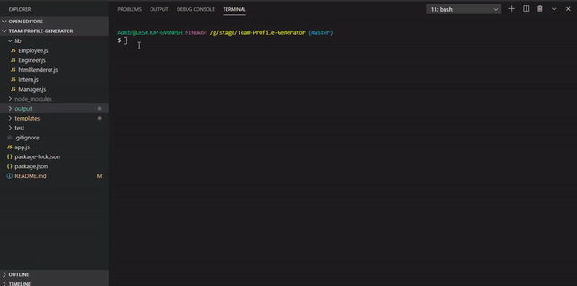

# Team Profile Generator

https://sujatha-m.github.io/Team-Profile-Generator/

## Table of Contents
   * [Description](#description)
   * [Usage](#usage)
   * [Installation](#installation)
   * [Badges](#badges)
   * [Contributing](#contributing)
   * [License](#license)
   * [Tests](#tests)
   * [Visuals](#visuals)

## Description
The goal is to build a software engineering team generator command line application. The application will prompt the user for information about the team manager and then information about the team members. The user can input any number of team members, and they may be a mix of engineers and interns. The assignment should also pass all unit tests. When the user has completed building the team, the application will create an HTML file that displays a nicely formatted team roster based on the information provided by the user.

## Badges
[](https://img.shields.io/github/followers/sujatha-m?style=social)
[](https://img.shields.io/website?url=https%3A%2F%2Fsujatha-m.github.io%2FWeather-Dashboard%2FDevelop%2F)


## Visuals



## Installation
#### & Guidelines
* Use the Inquirer npm package to prompt the user for their email, id, and specific information based on   their role with the company. For instance, an intern may provide their school, whereas an engineer may provide their GitHub username.

* The app will run as a Node CLI to gather information about each employee.

* In the folder there is a package.json, so make sure to npm install.

* The dependencies are, jest for running the provided tests, and inquirer for collecting input from the user.

* There are also unit tests to help you build the classes necessary.

It is recommended that you follow this workflow:

1. Run tests
2. Create or update classes to pass a single test case
3. Repeat
The tests can be run at any time with npm run test

## Usage
```sh
node app.js
```

## Contributing
Pull requests are welcome. For major changes, please open an issue first to discuss what you would like to change.
Please make sure to update tests as appropriate.

## Tests
npm run test

## License 
[MIT](https://choosealicense.com/licenses/mit/)

## Questions
# 

jhanavi.bhushan@gmail.com